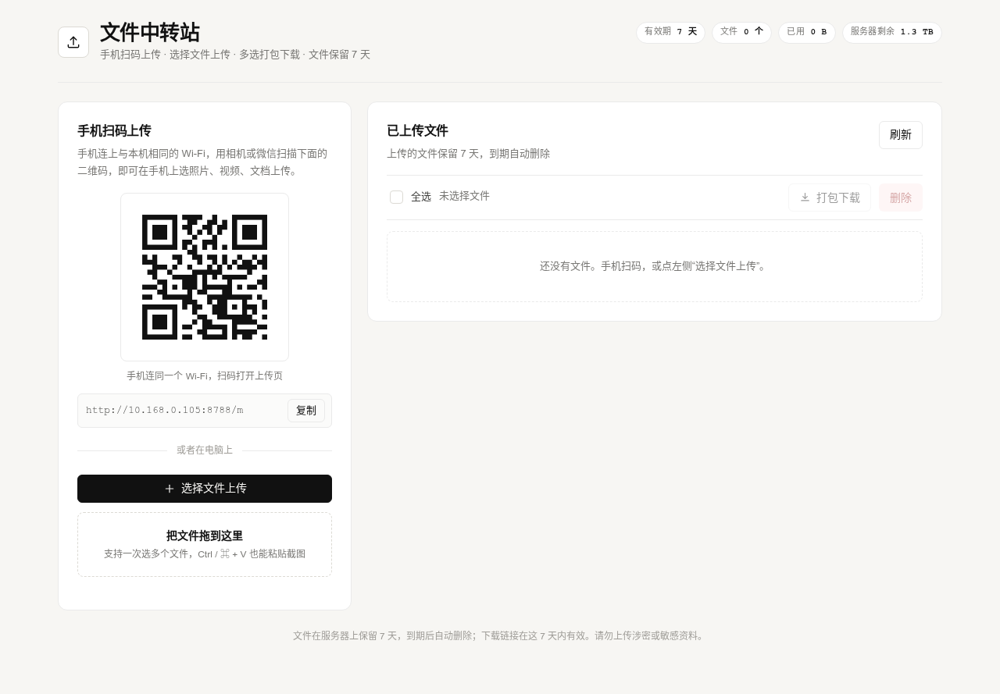
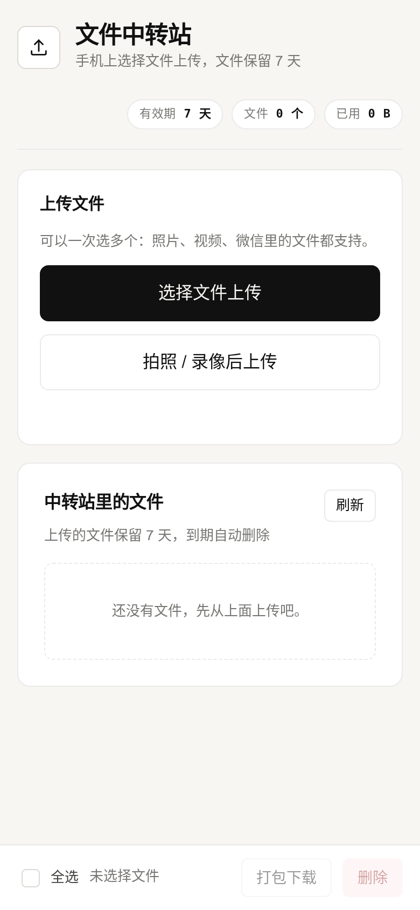

# 文件中转站（FileHub）

一个跑在自己机器上的临时文件中转站：**手机扫码上传**、**电脑选择文件上传**、**多选打包下载**，上传的文件 **7 天后自动过期删除**。

- 零第三方依赖：后端只用 Python 标准库（二维码复用系统里已有的 qrcode + Pillow），前端是原生 HTML/CSS/JS。
- 单文件上限默认 2 GB（可调），支持拖拽、粘贴截图、一次选多个文件。
- 打包下载是流式 ZIP（服务端不额外占磁盘），中文文件名在 ZIP 内和下载响应头里都正确。
- 单个文件下载支持 Range 断点续传。

## 快速开始

~~~
cd ~/filehub
./start.sh          # 启动（默认 0.0.0.0:8788，文件保留 7 天）
./status.sh         # 查看状态和文件列表
./stop.sh           # 停止
~~~

启动后会打印两个地址：

- 电脑上打开（上传 + 多选下载）：http://10.168.0.105:8788
- 手机扫码后打开的上传页：http://10.168.0.105:8788/m

首页左侧会自动生成指向 /m 的二维码：手机连**同一个 Wi-Fi**，用相机或微信扫一下，就能在手机上选照片、视频、微信文件上传。

改端口 / 改有效期 / 改单文件上限：

~~~
PORT=9000 TTL_DAYS=3 MAX_MB=4096 ./start.sh
# 或者直接跑：python3 server.py --port 9000 --ttl-days 3 --max-mb 4096
~~~

## 怎么用

**上传（三种方式）**

1. 手机扫码打开 /m，点「选择文件上传」（可多选）或「拍照 / 录像后上传」。
2. 电脑点「选择文件上传」，一次可以选多个文件。
3. 电脑把文件拖到虚线框里，或直接按 Ctrl / Command + V 粘贴截图。

每个文件都有独立进度条，最多 2 个并发；某一条失败可以单独「重试」，不影响其它文件。

**下载**

- 单个文件：每行的「下载」按钮；也可以点「复制链接」拿到 7 天内有效的直链发给别人。
- 多个文件：勾选复选框（或点「全选」）→「打包下载」，服务端把选中的文件流式打成一个 zip，文件名形如 中转站_20261007_0941.zip。
- 手机端同样支持勾选后打包下载，操作栏固定在屏幕底部。

**有效期**

- 上传时记录过期时间（默认 +7 天），列表里显示「剩 X 天 X 小时」，最后一天标红。
- 过期后：列表里不再出现、直链返回 404；后台巡检线程（默认每 60 秒）删除磁盘文件；服务重启时也会先清理一遍。
- 想立刻删除，勾选后点「删除」（会二次确认）。

## 目录结构

~~~
filehub/
├── server.py            # 全部后端逻辑（HTTP 服务、上传、下载、打包、二维码、过期清理）
├── start.sh             # 启动（setsid + nohup，关掉终端也不会停）
├── stop.sh              # 停止
├── status.sh            # 状态 / 文件列表
├── static/
│   ├── index.html       # 桌面端首页：二维码 + 选择文件上传 + 文件列表
│   ├── mobile.html      # 手机端上传页 /m
│   ├── style.css        # 样式（暖调单色，自动适配深色模式）
│   ├── app.js           # 前端逻辑（桌面端与手机端共用）
│   └── favicon.svg
├── data/
│   ├── index.json       # 文件元数据（原名、大小、上传时间、过期时间）
│   ├── blobs/<id>       # 文件本体，按随机 id 存放，原名只留在 index.json
│   └── server.log       # 运行日志
└── tests/
    ├── api_test.py      # 接口集成测试（隔离实例，端口 8798）
    ├── ttl_test.py      # 有效期 / 过期清理测试
    ├── ui_test.js       # 浏览器端到端测试（playwright-core，含截图）
    ├── screenshot.js    # 只截图，方便看效果
    └── shots/           # 截图产物
~~~

## 接口

| 方法 | 路径 | 说明 |
| --- | --- | --- |
| GET | / | 桌面端首页 |
| GET | /m | 手机上传页 |
| GET | /api/files | 文件列表（含剩余秒数） |
| GET | /api/info | 有效期、单文件上限、局域网地址、磁盘剩余 |
| PUT | /api/upload?name=…&mime=… | 上传，请求体就是文件原始字节 |
| GET | /d/<id> | 下载单个文件，支持 Range |
| GET | /zip?ids=a,b,c | 多选打包下载（流式 ZIP） |
| POST | /api/delete | 删除，body 形如 {"ids": ["a","b"]} |
| GET | /api/qr.png?url=… | 生成二维码 PNG |
| GET | /healthz | 健康检查 |

## 测试

~~~
cd ~/filehub
python3 tests/api_test.py      # 上传/列表/下载/Range/打包/删除/二维码/静态页，跑在隔离实例上，不碰线上数据
python3 tests/ttl_test.py      # 用很短的 TTL 验证过期后列表消失、下载 404、磁盘文件被清理
NODE_PATH=/home/gazer/.theme-debug/node_modules node tests/ui_test.js   # 真实浏览器：上传、多选、打包下载、手机端页面
~~~

## 注意事项

- **没有登录鉴权**：同一局域网内知道地址的人都能上传、下载、删除。只适合临时中转，不要放涉密或敏感资料，用完记得删除。
- **外网访问已经配好**：Cloudflare 隧道（容器 `cf-tunnel`，命名隧道 gaoxiao）里加了一条 ingress
  `file.gaoxiao.asia` → `http://127.0.0.1:8788`，所以手机用 4G/5G 也能扫码上传：
  https://file.gaoxiao.asia （配置在 `~/.cloudflared/config-docker.yml`，改完执行 `docker restart cf-tunnel`）。
  注意两点：① Cloudflare 免费版**单个请求体上限 100 MB**，超过 100 MB 的文件走公网会失败（前端会提前识别并跳过，提示改用局域网），走局域网不受影响；
  ② 公网域名**同样没有鉴权**，任何拿到链接的人都能上传/下载/删除。想收紧的话，最省事的是叠一层 Cloudflare Access 邮箱验证码。
- 手机扫码打不开时：确认手机连的是同一个 Wi-Fi（不是 4G/5G），再确认主机防火墙放行了 8788 端口。
- 关掉终端不会停服务（start.sh 用了 setsid + nohup）；机器重启后需要重新 ./start.sh，或者自己加一条 @reboot 的 crontab。
- 备份 / 迁移只需要整个 data/ 目录：index.json 与 blobs/ 里的文件一一对应。
